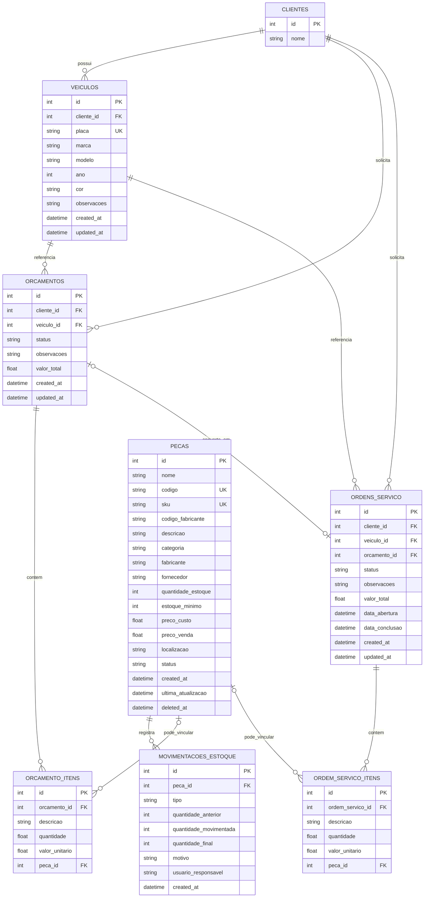
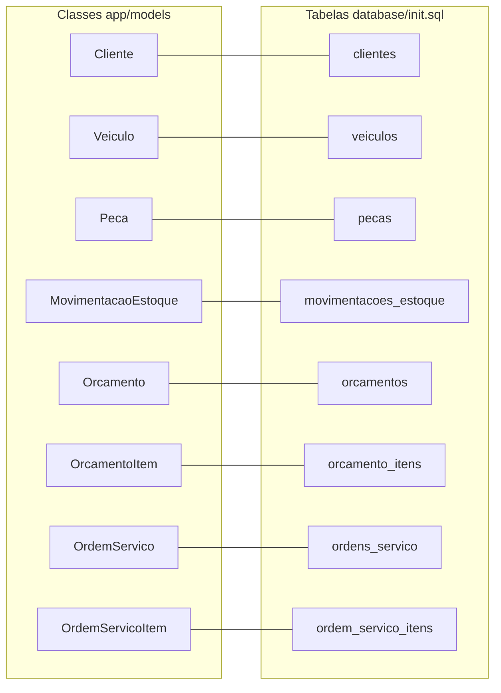

# MER — Apollo

Modelo entidade-relacionamento do PostgreSQL (`database/init.sql`).

```mermaid
erDiagram
    CLIENTES ||--o{ VEICULOS : possui
    CLIENTES ||--o{ ORCAMENTOS : solicita
    CLIENTES ||--o{ ORDENS_SERVICO : solicita
    VEICULOS ||--o{ ORCAMENTOS : referencia
    VEICULOS ||--o{ ORDENS_SERVICO : referencia
    ORCAMENTOS ||--o{ ORCAMENTO_ITENS : contem
    ORCAMENTOS |o--o| ORDENS_SERVICO : converte_em
    ORDENS_SERVICO ||--o{ ORDEM_SERVICO_ITENS : contem
    PECAS ||--o{ MOVIMENTACOES_ESTOQUE : registra
    PECAS |o--o{ ORCAMENTO_ITENS : pode_vincular
    PECAS |o--o{ ORDEM_SERVICO_ITENS : pode_vincular

    CLIENTES {
        int id PK
        string nome
    }

    VEICULOS {
        int id PK
        int cliente_id FK
        string placa UK
        string marca
        string modelo
        int ano
        string cor
        string observacoes
        datetime created_at
        datetime updated_at
    }

    PECAS {
        int id PK
        string nome
        string codigo UK
        string sku UK
        string codigo_fabricante
        string descricao
        string categoria
        string fabricante
        string fornecedor
        int quantidade_estoque
        int estoque_minimo
        float preco_custo
        float preco_venda
        string localizacao
        string status
        datetime created_at
        datetime ultima_atualizacao
        datetime deleted_at
    }

    MOVIMENTACOES_ESTOQUE {
        int id PK
        int peca_id FK
        string tipo
        int quantidade_anterior
        int quantidade_movimentada
        int quantidade_final
        string motivo
        string usuario_responsavel
        datetime created_at
    }

    ORCAMENTOS {
        int id PK
        int cliente_id FK
        int veiculo_id FK
        string status
        string observacoes
        float valor_total
        datetime created_at
        datetime updated_at
    }

    ORCAMENTO_ITENS {
        int id PK
        int orcamento_id FK
        string descricao
        float quantidade
        float valor_unitario
        int peca_id FK
    }

    ORDENS_SERVICO {
        int id PK
        int cliente_id FK
        int veiculo_id FK
        int orcamento_id FK
        string status
        string observacoes
        float valor_total
        datetime data_abertura
        datetime data_conclusao
        datetime created_at
        datetime updated_at
    }

    ORDEM_SERVICO_ITENS {
        int id PK
        int ordem_servico_id FK
        string descricao
        float quantidade
        float valor_unitario
        int peca_id FK
    }
```

> Nota: `ordens_servico.orcamento_id` é FK **e** UNIQUE no SQL (`0..1` ↔ `0..1`).

## Relação classe ↔ tabela

```mermaid
flowchart LR
    subgraph Dominio["Classes app/models"]
        C[Cliente]
        V[Veiculo]
        P[Peca]
        M[MovimentacaoEstoque]
        O[Orcamento]
        OI[OrcamentoItem]
        OS[OrdemServico]
        OSI[OrdemServicoItem]
    end

    subgraph Banco["Tabelas database/init.sql"]
        TC[clientes]
        TV[veiculos]
        TP[pecas]
        TM[movimentacoes_estoque]
        TO[orcamentos]
        TOI[orcamento_itens]
        TOS[ordens_servico]
        TOSI[ordem_servico_itens]
    end

    C --- TC
    V --- TV
    P --- TP
    M --- TM
    O --- TO
    OI --- TOI
    OS --- TOS
    OSI --- TOSI
```
